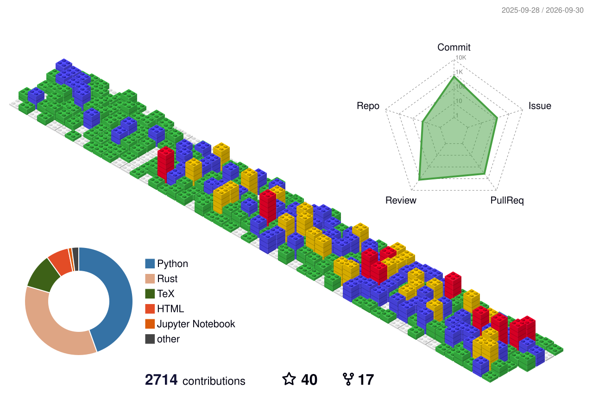

  <samp>
    <h1>Hi there! :wave: <!--- ---></h1> 
    
I'm Francisco. I love code and I love to build things.

    
I'm a Forward Deployed Engineer at <a href="https://www.baseten.co/">Baseten</a>
 working on everything inference.
    
I am also a maintainer for <a =href"https://vllm-project.github.io/agentic-api/">vLLM Agentic API</a>, <a href="https://www.feast.dev">Feast</a>—the open source Feature Store
, and I am also on the Steering Committee for <a href="https://www.kubeflow.org">Kubeflow</a>—the open source AI platform.

  </samp>

    

Did you find a bug in something I built? :worried:  
Feel free to tell me about it on <a href="https://x.com/franciscojarceo">X/Twitter!</a> :blush:

  <a href="https://commit-history.com/franciscojavierarceo">
    <picture>
      <source media="(prefers-color-scheme: dark)" srcset="https://commit-history.com/embed/franciscojavierarceo?theme=dark" />
      
    </picture>
  </a>

